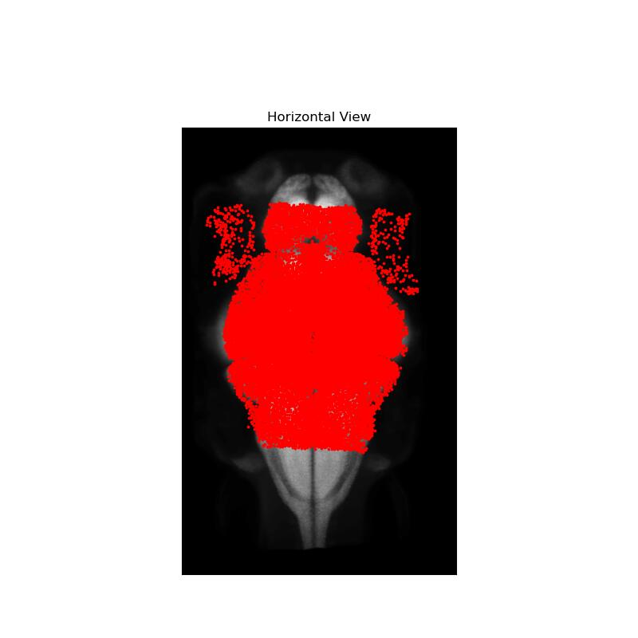
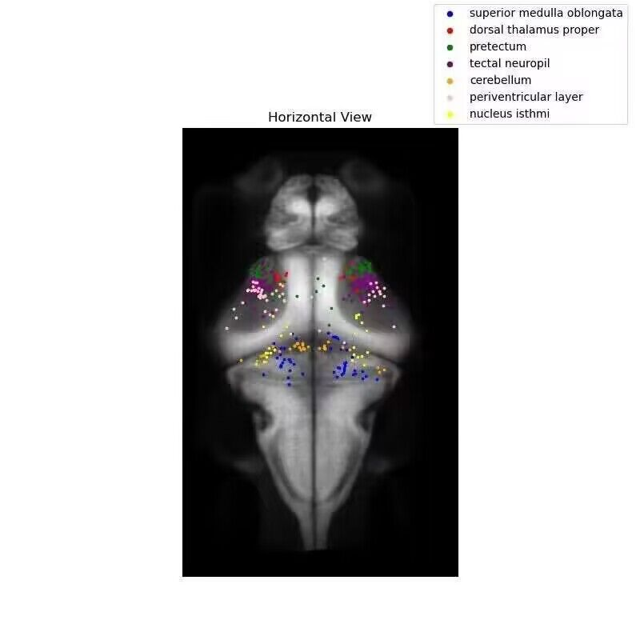
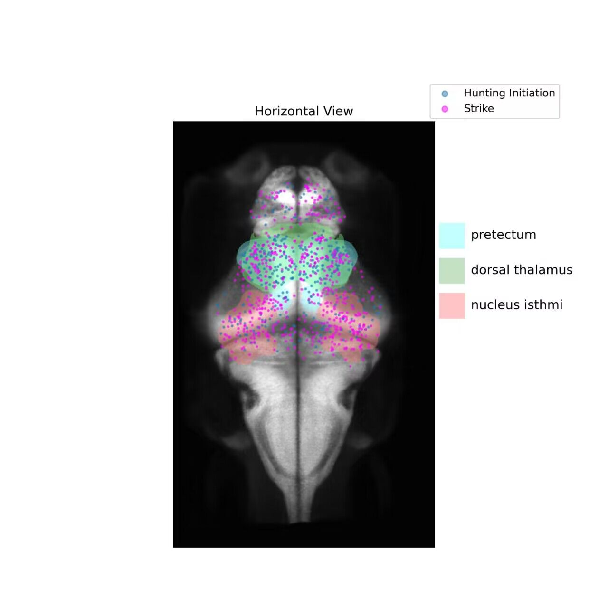
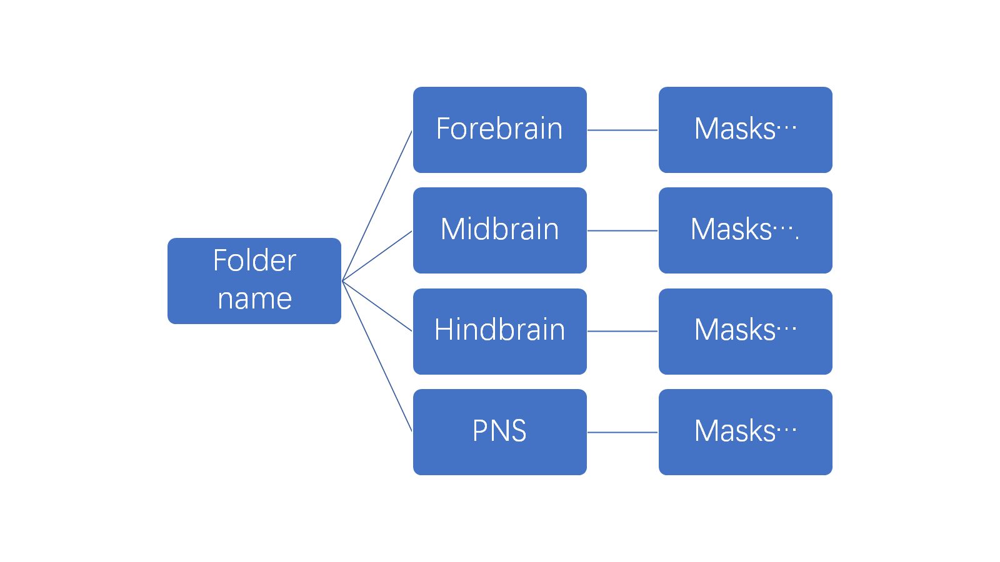

# Zebrafish Brain Visualization

[//]: # ()

[//]: # ()

[//]: # ()

[//]: # ()

[](LICENSE)
[](https://github.com/RichardLitt/standard-readme)

This is a pipeline for 2D zebrafish brain visualization.

## Description
This easy-to-use pipeline has three functions.
1. Show the range of 2p image scanning.

2. Show different neurons in different brain areas.

3. Add masks to the atlas and show neurons of interest.


## Table of Contents

- [Preparation](#Preparation)
- [Packages](#Packages)
- [Function1](#Function1)
- [Function2](#Function2)
- [Function3](#Function3)
- [Contributing](#contributing)


## Preparation

### Input
1. CSV files of ROI coordinates.
2. Atlas and masks downloaded from [mapzebrain](https://mapzebrain.org/atlas/2d).
### Tools
1. PyCharm or any python IDE.
2. Fuji (imageJ).

## Packages


```python
import csv
import matplotlib.pyplot as plt
import tifffile
import os
import numpy as np
import pandas as pd
from PIL import Image
import fileinput
```


## Function1
### Show the range of 2p image scanning
For each dataset, we have n fish (n=6 in our example).
For each fish, we have 9 planes.
### 1. Merge the coordinates of planes in all fish.
Modify your path in [mergecsv.py](mergecsv.py).
```python
file1 = "E:\\new_roi1107\\2023-07-05_F2_highintensity\\Plane2_roi_coordinates_0.5_reg.csv"
file2 = "E:\\new_roi1107\\transformation\\2023-07-13_F5_lowintensity\\Plane2_roi_coordinates_0.5_reg.csv"
file3 = "E:\\new_roi1107\\transformation\\2023-08-04_F5_highintensity\\Plane2_roi_coordinates_0.5_reg.csv"
file4 = "E:\\new_roi1107\\transformation\\2023-08-11_F2_lowintensity_2\\Plane2_roi_coordinates_0.5_reg.csv"
file5 = "E:\\new_roi1107\\transformation\\2023-08-11_F5_lowintensity_2\\Plane2_roi_coordinates_0.5_reg.csv"
file6 = "E:\\new_roi1107\\transformation\\2023-08-11_F8_lowintensity\\Plane2_roi_coordinates_0.5_reg.csv"
file7 = "E:\\new_roi1107\\transformation\\2023-09-21_F3_2deg\\Plane2_roi_coordinates_0.5_reg.csv"
file8 = "E:\\new_roi1107\\transformation\\2023-09-22_F1_2deg_2\\Plane2_roi_coordinates_0.5_reg.csv"
file9 = "E:\\new_roi1107\\transformation\\2023-09-22_F6_2deg\\Plane2_roi_coordinates_0.5_reg.csv"
```
Don't forget to change output file name.
```python
output_directory = "E:\\new_roi1107\\fivefish\\"
output_file_name = "merged_plane2.csv"
output_path = output_directory + output_file_name
```
Do 9 planes one by one.

### 2. Create three views of standard zebrafish brain.
There are two ways to get horizontal, sagittal and coronal views.
- Directly use ImageJ, Image -> Z Project.
- Change path and axis direction in [getview.py](getview.py).

Change atlas path. It could be the path of atlas or masks.
```python
mask_path="Your path..."
```
Change axis.
```python
average_xy = np.mean(tif_data, axis=1)
```
### 3. Scatter neurons to three views of atlas.
Input merged planes' coordinates. Change your path.
```python
# Input csv
csv_file1 = "E:\\new_roi1107\\result1107\\RGB_Values_plane2.csv"
df1 = pd.read_csv(csv_file1)
csv_file2 = "E:\\new_roi1107\\result1107\\RGB_Values_plane3.csv"
df2 = pd.read_csv(csv_file2)
csv_file3 = "E:\\new_roi1107\\result1107\\RGB_Values_plane4.csv"
df3 = pd.read_csv(csv_file3)
csv_file4 = "E:\\new_roi1107\\result1107\\RGB_Values_plane5.csv"
df4 = pd.read_csv(csv_file4)
csv_file5 = "E:\\new_roi1107\\result1107\\RGB_Values_plane6.csv"
df5 = pd.read_csv(csv_file5)
csv_file6 = "E:\\new_roi1107\\result1107\\RGB_Values_plane7.csv"
df6 = pd.read_csv(csv_file6)
csv_file7 = "E:\\new_roi1107\\result1107\\RGB_Values_plane8.csv"
df7 = pd.read_csv(csv_file7)
csv_file8 = "E:\\new_roi1107\\result1107\\RGB_Values_plane9.csv"
df8 = pd.read_csv(csv_file8)
csv_file9 = "E:\\new_roi1107\\result1107\\RGB_Values_plane10.csv"
df9 = pd.read_csv(csv_file9)
```
Input different views in different python programs.\
Horizontal View: [scatter9p_xy.py](scatter9p_xy.py)\
Sagittal View: [scatter9p_yz.py](scatter9p_yz.py)\
Coronal View: [scatter9p_xz.py](scatter9p_xz.py)

```python
tif_file = "E:\\Atlas\\AVGxy_HSA.tif"
```
[//]: # (Note: The `license` badge image link at the top of this file should be updated with the correct `:user` and `:repo`.)


## Function2

### Show different neurons in different brain areas.
### 1. Prepare 3 views of atlas, your ROI coordinates and all masks covering whole brain. 
### 2. Run mapping program, locate which brain area nuerons belong to.
Change your path in [finalpipeline_use.py](finalpipeline_use.py).
```python
import csv
import matplotlib.pyplot as plt
import tifffile
import os
import numpy as np

folder_path = "Your directory" # Path of output csv file.
mask_path = "Path of Your masks." # Be careful, folder name should follow a structure of two stages of folder as the figure below shows.
csv_file ="Your ROI coordinates" # Path of registered coordinates
points = []  # save coordinates
plane_num = "_pc"  # remember to change this for prey capture and strike or any other behavior.
```


Check if x,y,z are in the correct row number.
```python
with open(csv_file, 'r') as file:
    csv_reader = csv.reader(file)
    next(csv_reader)  # Skip title
    for row in csv_reader:
        x, y, z = map(float, row[4:7])  # read reg_x,reg_y,reg_z
        points.append((int(round(x)), int(round(y)), int(round(z))))  # approximity
print(points[0])
```
Output will be two csv files, recording how many neurons are in each brain region and which areas every neuron belongs to. 
### 3. Scatter classified neurons to our atlas with different colors for different brain regions.
Change your path and color setting in [scatter_xy.py](scatter_xy.py), [scatter_xz.py](scatter_xz.py), [scatter_yz.py](scatter_yz.py).
### 4. Get distribution barchart.
Change your path and color setting in [colorful_bar.py](colorful_bar.py).

## Function3
### Add masks to the atlas and show neurons of interest.
### 1. Merge masks with atlas.
- Save three views of chosen masks.
- Open them in Fuji, click Lookup Table, set different color for different masks and save.
- Run [mergetif.py](mergetif.py). Change your path and get three views atlas with colored masks.
- You can also change the opacity.
```python
if __name__ == "__main__":
    grayscale_path = "E:\\Atlas\\HSA_yz.tif" # Path of one view of your atlas.
    color_channel_paths = [
        "E:\\Atlas\\nucleus_isthmi_yz.tif",
        "E:\\Atlas\\pretectum_yz.tif",
        "E:\\Atlas\\dorsal_thalamus_proper_yz.tif",

    ]
    output_path = "E:\\Atlas\\final\\coronal_view.tif"
    object_opacity = 0.25  # Set opacity

    merge_channels(grayscale_path, color_channel_paths, output_path, object_opacity)
```
### 2. Run mapping process
Run [finalpipeline_use.py](finalpipeline_use.py). Get 2 csv files.
### 3. Filter noise
Set a proper threshold.\
Manually delete noise neurons in generated csv file in step.\
Add one row titled [G] in the first csv file with "RGB" in name. (No meaning just for plotting)
### 4. Manually create a new coordinates file with more information. (Optional)
You can add some rows in the first csv file with "RGB" in its name to your original coordinates, for they are well-matched in position(before filter).
Need to run step2 differently! Record all values at first.
```python
    for point in points:
        x, y, z = point
        for mask_filename, mask_data in point_to_mask.items():
            if mask_data.shape[0] > z:
                frame = mask_data[z]
                rgb_value = frame[y, x]
                writer.writerow({'Mask': mask_filename, 'Frame': z, 'Point_X': x, 'Point_Y': y, 'RGB_Value': rgb_value})
                # if rgb_value != 0:  # Only save rows where RGB value is not 0
                #     writer.writerow(
                #         {'Mask': mask_filename, 'Frame': z, 'Point_X': x, 'Point_Y': y, 'RGB_Value': rgb_value})
```
Then run [sortcsv.py](sortcsv.py) and [sortcsv2.py](sortcsv2.py) sequentially.\
You might need to check title name and modify a bit before running. \
You can get every neurons' position information, including neurons belongs to no brain areas.\
After that, you should copy the row of new information to the original coordinates csv file, and named it Combined_label.\
Finally you have the information of neuron coordinates, fish number, brain areas, which helps you to plot according to different groups.
### 5. Scatter filtered pc and strike neurons to atlas.
Change your path in [scatter_merge_xy.py](scatter_merge_xy.py), [scatter_merge_xz.py](scatter_merge_xz.py),[scatter_merge_yz.py](scatter_merge_yz.py).\
If you did the 4th step, you can scatter them differently.
## Contributing

See [the contributing file](CONTRIBUTING.md)!

PRs accepted.

Small note: If editing the Readme, please conform to the [standard-readme](https://github.com/RichardLitt/standard-readme) specification.

### Any optional sections

